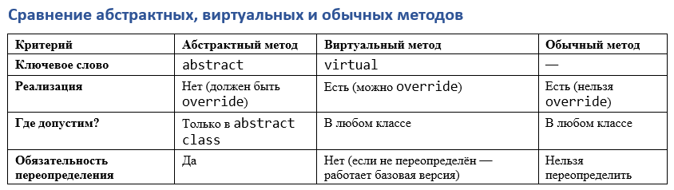
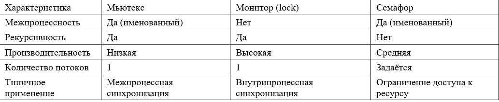

# 1.	Понятие объектно-ориентированного программирования (ООП). Основные принципы ООП. Наследование, агрегация, композиция. Примеры реализации принципов ООП в ЯП C#.

ООП - парадигма программирования, в которой программа строится на основе объектов и их взаимодействия между ними.

Инкапсуляция - Возможность управления сложным объектом без понимания его структуры. Сокрытие внутренней реализации объекта, представление необходимого интерфейса. В C# для этого есть модификаторы доступа public, protected, private
```c#
public class BankAccount
{
    private decimal _balance;  // Поле скрыто

    public void Deposit(decimal amount) => _balance += amount;
    public decimal GetBalance() => _balance;
}
```
Наследование - Создание нового класса на основе уже созданного с возможностью расширения и/или изменения поведения.
```c#
public class Animal
{
    public void Eat() => Console.WriteLine("Eating...");
}

public class Dog : Animal
{
    public void Bark() => Console.WriteLine("Barking...");
}
```
Агрегация - Штука похожая на наследование, но объекты могут существовать независимо. 
```c#
public class Engine { }

public class Car
{   
    // Объект передается извне (например через конструктор)
    private Engine _engine;
    public Car(Engine engine) => _engine = engine;  // Агрегация
}
```
Композиция - Штука похожая на агрегацию, но более строгая. Часть не может существовать без целого.
```c#
public class House
{
    private Roof _roof = new Roof();  // Композиция
    
    public House() 
    {
        // _roof не может существовать без House
    }
}
```
Полифорфизм - Возможность объектов с одинаковым интерфейсом иметь разную реализацию. В C# реализуется через переопределение методов (virtual/override) и интерфейсы.
```c#
public class Shape
{
    public virtual void Draw() => Console.WriteLine("Drawing a shape");
}

public class Circle : Shape
{
    public override void Draw() => Console.WriteLine("Drawing a circle");
}
```
Абстрация - Выделение основных характеристик объекта, игнорируя несущественные детали. В C# реализуется с помощью абстрактных классов и интерфейсы
```c#
public abstract class Vehicle
{
    public abstract void Move();
}

public class Car : Vehicle
{
    public override void Move() => Console.WriteLine("Driving...");
}
```

# 2. Понятие класса. Основные элементы классов. Отличия класса и объекта.

Класс - шаблон для создания объектов. Класс определяет - данные (поля и свойства), методы, конструкторы. Если спросит чем поле отличается от свойства, то поле хранит данные объекта (обычно оно private), а свойство контроллирует доступ к поляем get/set.

```c#
private int _id; // Поле
public string Name { get; set; } // Свойство
```
```c#
Person person = new Person();
person.Name = "Милана";                // Вызывается set
Console.WriteLine(person.Name);       // Вызывается get
```
```c#
public string Email { get; private set; }  // Запись только внутри класса
public string Password { private get; set; } // Только запись
```

Объект - реализация класса. Класс существует в коде, объект создается в памяти во время выполнения проги. Класс имеет несколько объектов. Объект - отдельная сущность.

# 3. Ссылочные и значимые типы данных. Примеры, объявление и инициализация переменных. Приведение ссылочных и значимых типов данных. Понтие nullable типов данных.

| Значимые типы                                                 | Ссылочные типы                                          |
|---------------------------------------------------------------|---------------------------------------------------------|
| int, double, float, short, перечисления, структуры и подобные | классы, объекты, строки, массивы, интерфейсы, делегаты, |
| Хранятся в стеке                                              | Хранятся в куче                                         |
| При присваивании значение копируется                          | При присваивании копируется ссылка                      |
| По умолчанию не могут быть Nullable, но можно сделать int?    | По умолчанию могут быть Nulllable                       |
|                                                               |                                                         |
Приведение типов
Значимые типы:
Неявное
```c#
int i = 10;
double d = i;  // Неявное приведение int → double
```
Явное
```c#
double d = 10.5;
int i = (int)d;  // Явное приведение double → int (i = 10)
```
Ссылочные типы:
Неявное
```c#
string s = "Hello";
object obj = s;  // string → object (автоматически)
```
явное
```c#
object obj = "Hello";
string s = (string)obj;  // object → string (требуется явное приведение)
```

# 4. Модификаторы доступа к элементам класса. Конструктор и финализатор. Насаледование конструкторов и финализаторов. Ключевые слова base и this.

```c#
var obj = new Person();
Console.WriteLine(obj.Name); // Конструктор по умолчанию + Статический конструктор
var obj2 = new Person("Alice", 25); // Пользовательский конструктор
Console.WriteLine(obj2.Name);
public class Person
{
    public string Name { get; }
    public int Age { get; }

    // Конструктор по умолчанию
    public Person()
    {
        Name = "Unknown";
        Age = 0;
    }

    // Пользовательский конструктор
    public Person(string name, int age)
    {
        Name = name;
        Age = age;
    }

    // Статический конструктор
    static Person()
    {
        Console.WriteLine("Класс Person загружен");
    }
    // Финализатор
    ~Person()
    {
        Console.WriteLine("Финализатор вызван");
    }
}
```
Конструкторы не наследуются, но можно вызвать конструктор отца через base
```c#
public class Animal
{
    public string Name { get; }

    public Animal(string name)
    {
        Name = name;
    }
}

public class Dog : Animal
{
    public int Age { get; }

    // Вызов конструктора базового класса через base
    public Dog(string name, int age) : base(name)
    {
        Age = age;
    }
}
```
this - это "ссылка" на текущий объект класса.
base - это "ссылка" на родителя текущего объекта класса.
Соответственно можно использовать например this.name = "Степа" - присвоили имя; base.GetElementById(); - вызвали метод у отца.

# 5. Использование ключевого слова static. Что означает модификатор static при применении к классу, полу/свойству, конструктору/финализатору. Где в памяти располагаются статические поля? 

static применяется для создания элементов, которые принадлежал классу, а не объекту (общие для всех объектов), существуют на протяжении всей работы программы и не требуют создание объекта для доступа.

## static у классов
Статический класс не может иметь объектов, имеет только статические члены
```c#
public static class MathUtils
{
    public static double Pi => 3.14159;
    
    public static int Add(int a, int b) => a + b;
}

// Использование (без создания объекта)
double pi = MathUtils.Pi;
int sum = MathUtils.Add(5, 3);
```

## static у полей и свойств

```c#
public class Counter
{
    public static int TotalCount { get; } // Общий счётчик
    
    public Counter() 
    {
        TotalCount++; // Увеличивается при каждом создании объекта
    }
}

var c1 = new Counter(); // TotalCount = 1
var c2 = new Counter(); // TotalCount = 2
Console.WriteLine(Counter.TotalCount); // 2
```

## static у методов

Статический метод — вызывается без создания объекта, работает только со статическими полями.
Не имеет доступа не статик членам класса, this не дам, не даааам

```c#
public static class Logger
{
    private static int _logCount = 0;
    
    public static void Log(string message)
    {
        _logCount++;
        Console.WriteLine($"[Log #{_logCount}] {message}");
    }
}

Logger.Log("Error!"); // [Log #1] Error!
```
Статический конструктор используется для инициализации статических полей и вызывается при первом использовании класса
Статический финализатор вызывается при выгрузке класса из памяти

статические поля хранятся в High Frequency Heap (отдельная часть в куче), существуют на протяжении работы программы, не удаляются сборщиком мусора

# 6. Использование ThreadStatic / AsyncLocal. Взаимодействие static с потоками

Суть в чем? static поля одни для всех потоков, и если 2 потока попытаются одновременно обратиться к 1 статик полю то случится ошибка race conditions (Гонка данных). Есть 2 решения:
## ThreadStatic
Атрибут [ThreadStatic] делает поле уникальным для каждого потока. Инициалиизируется для каждого потока заново. Не работает с статическими свойствами. ТОЛЬКО ПОЛЯ.
```c#
public static class PerThreadCounter
{
    [ThreadStatic]
    public static int Value = 10; // Инициализация только для первого потока!
}

// Поток 1:
PerThreadCounter.Value = 1;
Console.WriteLine(PerThreadCounter.Value); // 1

// Поток 2:
PerThreadCounter.Value = 2;
Console.WriteLine(PerThreadCounter.Value); // 2 (не влияет на первый поток)
```
## AsyncLocal<T>
Класс AsyncLocal<T> хранит данные, сохраняющиеся при переключении контекста (например, в async/await)
Значение наследуется дочерними задачами, изменения не видны в родительском потоке.
```c#
public static class AsyncContext
{
    public static AsyncLocal<string> RequestId = new AsyncLocal<string>();
}

// Главный поток:
AsyncContext.RequestId.Value = "ABC";

await Task.Run(() => 
{
    Console.WriteLine(AsyncContext.RequestId.Value); // "ABC" (унаследовано)
    AsyncContext.RequestId.Value = "XYZ"; // Изменяется только для этого потока
});

Console.WriteLine(AsyncContext.RequestId.Value); // "ABC" (родительский контекст)
```


# 7. Использование абстрактных классов и методов. Инициализация переменных типа абстрактного класса, создание объектов абстрактного класса. Наследование абстрактных классов. Отличие от виртуальных методов и обычных методов

В C# существует возможность введения в базовом классе методов, а их реализацию оставить «на потом». Такие методы называют абстрактными. Абстрактный метод автоматически является и виртуальным, но писать это нельзя. Класс, в котором имеется хотя бы один абстрактный метод, тоже называется абстрактным и такой класс может служить только в качестве базового класса. Создать объекты абстрактных классов невозможно, потому что там нет реализации абстрактных методов. Чтобы класс – наследник абстрактного класса не был в свою очередь абстрактным (хотя и это не запрещено), там должны содержаться переопределения всех наследованных абстрактных методов. Указатель на абстрактный класс может указывать на любой класс – наследник.

Абстрактный класс нельзя создать напрямую (нельзя new AbstractClass()) может содержать абстрактные методы без реализации и обычные методы, используется как базовый для наследников.

Асбтрактные методы не имеют тела, должны быть переопределены override в наследниках, Помечаются ключевым словом abstract
```c#
public abstract class Animal
{
    public string Name { get; set; }  // Обычное свойство
    
    public abstract void MakeSound();  // Абстрактный метод (без реализации)
    
    public void Sleep()               // Обычный метод
    {
        Console.WriteLine($"{Name} is sleeping...");
    }
}

public class Dog : Animal
{
    public override void MakeSound()  // Обязательная реализация
    {
        Console.WriteLine("Bark!");
    }
}

// Использование
Animal animal = new Dog();  // Можно создать только наследника
animal.MakeSound();         // "Bark!"
animal.Sleep();             // Реализация из Animal
```

# 8. Использование виртуальных методов. Переопределение методов и операторов. Отличие от абстрактных методов и обычных методов

Метод, при определении которого присутствует слово virtual, называется виртуальным. Каждый класс - наследник может иметь собственную версию виртуального метода, называется это переопределением и обозначается словом override. В C# выбор версии виртуального метода осуществляется в соответствии со значением указателя на момент вызова (а не типом указателя). Это делается во время выполнения программы. Указатель во время выполнения программы может указывать на объекты различных классов, поэтому по одному и тому же указателю могут вызываться разные версии виртуального метода. Переопределенные методы обеспечивают поддержку полиморфизма. Полиморфизм позволяет определять в базовом классе методы, которые будут общими для всех наследников, но каждый наследник, в случае необходимости, может иметь их собственные реализации. Естественно, что интерфейсы виртуального метода и всех его версий должны полностью совпадать. Таким образом, применение виртуальных методов позволяет фиксировать интерфейс метода и потом разработать под этот интерфейс новые реализации. Виртуальными могут быть и свойства, и индексаторы.

Виртуальные методы имеют реализацию в базовом классе, могут быть переопределены в наследниках, иначе работает базовая реализация
```c#
public class Vehicle
{
    public virtual void Move()
    {
        Console.WriteLine("Vehicle is moving");
    }
}

public class Car : Vehicle
{
    public override void Move()
    {
        Console.WriteLine("Car is driving");
    }
}

Vehicle v = new Car();
v.Move();  // "Car is driving" (вызов переопределённого метода)
```
Переопределение операторов 
```c#
public class Point
{
    public int X { get; set; }
    public int Y { get; set; }

    public static Point operator +(Point a, Point b)
    {
        return new Point { X = a.X + b.X, Y = a.Y + b.Y };
    }
}

Point p1 = new Point { X = 1, Y = 2 };
Point p2 = new Point { X = 3, Y = 4 };
Point p3 = p1 + p2;  // X=4, Y=6
```
Класс обязан быть public static



# 9. Понятие интерфейсов и их использование. Интерфейсные ссылки. Отличие интерфейсов от абстрактных классов. Понятие ковариантности и контр вариантности интерфейсов. 

Интерфейс (interface) — это контракт, который определяет какие методы и свойства должен реализовать класс. Интерфейс не содержит реализации. Класс может соответствовать нескольким интерфейсам. Используется для слабого связывания и полиморфизма. 

```c#
public interface ILogger
{
    void Log(string message);  // Метод без реализации
}

public class ConsoleLogger : ILogger
{
    public void Log(string message)  // Обязательная реализация
    {
        Console.WriteLine(message);
    }
}

// Использование
ILogger logger = new ConsoleLogger(); // Интерфейсная ссылка
logger.Log("Hello!");  // Вызов через интерфейсную ссылку
```
Отличие интерфейсов от абстратных классов

## Ковариантность и контрвариантность интерфейсов

Это механизмы, позволяющие безопасно работать с обобщёнными (generic) интерфейсами при наследовании.

### Ковариантность
Позволяет использовать более конкретный тип вместо общего, применяется ТОЛЬКО для возвращаемых значений.
Используется ключевое слово out.
```c#
public interface ICovariant<out T>
{
    T GetItem();  // T только на выходе
}

public class Animal { }
public class Dog : Animal { }

ICovariant<Dog> dogSource = ...;
ICovariant<Animal> animalSource = dogSource;  // Dog → Animal (ковариантность)

```
### Контрвариантность
Позволяет использовать более общий тип вместо конкретного, применяется ТОЛЬКО для входных параметров.
Используется ключевое слово in.
```c#
public interface IContravariant<in T>
{
    void Process(T item);  // T только на входе
}

IContravariant<Animal> animalProcessor = ...;
IContravariant<Dog> dogProcessor = animalProcessor;  // Animal → Dog (контравариантность)
```

Без in/out обобщённые интерфейсы инвариантны:
```c#
IEnumerable<Dog> dogs = new List<Dog>();
IEnumerable<Animal> animals = dogs;  // ОК (IEnumerable<out T>)
IList<Dog> dogList = new List<Dog>();
// IList<Animal> animalList = dogList;  // Ошибка! (IList<T> не ковариантен)
```

Интерфейсы могут содержать информацию по умолчанию
```c#
public interface ILogger
{
    void Log(string message);
    
    // Метод с реализацией
    void LogError(string error) => Log($"ERROR: {error}");
}

public class ConsoleLogger : ILogger
{
    public void Log(string message) => Console.WriteLine(message);
    // LogError не обязательно переопределять!
}

```
# 10. Генерация исключений и их обработка. Блоки обработки исключений. Генерация собственных типов исключений. Обработка исключений при многопоточном/асинхронном программировании
```c#
try
{
    // Код, который может вызвать исключение
    int x = 10 / int.Parse("0"); // DivideByZeroException
}
catch (DivideByZeroException ex)
{
    Console.WriteLine($"Ошибка: {ex.Message}"); // Обработка конкретного исключения
}
catch (Exception ex) // Общий обработчик
{
    Console.WriteLine($"Неизвестная ошибка: {ex.Message}");
}
finally
{
    Console.WriteLine("Этот блок выполнится в любом случае");
}
```
## Генерация исключений
throw - выброс исключения
```c#
if (age < 0)
{
    throw new ArgumentException("Возраст не может быть отрицательным");
}
```
Создание своих исключений путем наследования от базового класса исключения
```c#
public class MyCustomException : Exception
{
    public MyCustomException(string message) : base(message) { }
}

// Использование
throw new MyCustomException("Кастомная ошибка!");
```
## Исключения в многопоточности и асинхронном коде
В многопоточности try catch бесполезен. Решение - обработка исключения внутри потока с помощью Task + AggregateException

В асихнронном коде исклбчения пробрасываются через await 
```c#
try
{
    await Task.Run(() => throw new Exception("Ошибка в Task!"));
}
catch (Exception ex) // Сработает!
{
    Console.WriteLine(ex.Message);
}
```
Если в Task.WhenAll несколько исключений, они объединяются в AggregateException
```c#
try
{
    await Task.WhenAll(
        Task.Run(() => throw new Exception("Ошибка 1")),
        Task.Run(() => throw new Exception("Ошибка 2"))
    );
}
catch (AggregateException ae)
{
    foreach (var ex in ae.InnerExceptions)
        Console.WriteLine(ex.Message);
}
```

НЕ ИСПОЛЬЗОВАТЬ ОБРАБОТКУ ИСКЛЮЧЕНИЙ ДЛЯ ЛОГИКИ ПРОГРАММЫ! ОЧЕНЬ МЕДЛЕННО!!

# 11. Обобщенные типы данных. Наследование обобщенных типов данных. Ограничения, накладываемые на использование типов данных в обобщенных типах данных. Отличия от boxing/unboxing

Обобщённые типы (Generics) позволяют создавать типобезопасные классы, методы и интерфейсы, работающие с разными типами данных без дублирования кода.

```c#
public class Box<T>
{
    public T Content { get; set; }
}

Box<int> intBox = new Box<int> { Content = 42 };  // T = int
Box<string> strBox = new Box<string> { Content = "Hello" };  // T = string
```

```c#
public T Max<T>(T a, T b) where T : IComparable<T>
{
    return a.CompareTo(b) > 0 ? a : b;
}

int maxNumber = Max(10, 20);  // 20
string maxStr = Max("A", "B");  // "B"
```

Наследование обощенных классов
```c#
// Наследник с конкретным типом
public class Dog : Animal<string> { /* ... */ }

// Наследник с новым generic-параметром
public class Cat<U> : Animal<U> { /* ... */ }
```

Наследование обощенных интерфейсов
```c#
public interface IRepository<T> { /* ... */ }

public class UserRepository : IRepository<User> { /* ... */ }
```

Ограничения

```c#
public class Processor<T> where T : class, IComparable, new()
{
    public T CreateAndCompare(T a, T b)
    {
        T newObj = new T();  // Доступно благодаря new()
        return a.CompareTo(b) > 0 ? a : b;  // Доступно благодаря IComparable
    }
}
```
Boxing, упаковка - преобразование значимого типы в ссылочный, происходит неявно, когда значимый тип передаётся в метод, принимающий object
```c#
int a = 52;
object b = a; // Упаковка
```
Unboxing, распаковка - наоборот, из ссылочного в значимый, требует явного приведения
```c#
int c = (int)b;
```

# 12. Массивы и коллекции. Инициализация и использование. Отличия Array от List<T>. Преимущества использования Dictionary<TKey, TValue>? 
## Массив - это массив. Фиксированный размер, высокая производительность, поддерживаеют многомерность
```c#
// 1. Явное указание размера
int[] numbers = new int[3]; // [0, 0, 0]

// 2. Инициализация значениями
int[] nums = { 1, 2, 3 }; // [1, 2, 3]

// 3. Многомерные массивы
int[,] matrix = new int[2, 2] { { 1, 2 }, { 3, 4 } };
```
## List<T> - это список. динамическая коллекция, которая может увеличиваться. Поддерживает LINQ
```c#
List<string> names = new List<string>(); // Пустой список
names.Add("Alice"); // Добавление элемента
names.AddRange(new[] { "Bob", "Charlie" }); // Добавление нескольких

// Доступ по индексу
string first = names[0]; // "Alice"

// Удаление
names.Remove("Bob"); // Удаляет первое вхождение
names.RemoveAt(0); // Удаляет по индексу
```

## Словарь.
это вообще супер пиздатая вещь. просто божественная. Коллекция пар ключ-значение с ЕБАТЬ КАКИМ скоростным поиском по ключу. там вообще молния маквин такая КЧАУУУУУУУУУУУУУ
Тут тебе и скорость поиска по ключу, и ключом может быть любого типа, и дубликатов ключей нет, вообще секс

```c#
Dictionary<string, int> ages = new Dictionary<string, int>();
ages.Add("Alice", 25); // Добавление
ages["Bob"] = 30; // Альтернативный синтаксис

// Получение значения
int aliceAge = ages["Alice"]; // 25

// Проверка наличия ключа
if (ages.ContainsKey("Charlie"))
{
    Console.WriteLine(ages["Charlie"]);
}

// Удаление
ages.Remove("Bob");
```
# 13. Делегаты. Определение, объявление и вызов делегатов. Встроенные делегаты Action\Func\Predicate. Отличия от событий.
<<<<<<< HEAD
Делегат – это тип, который представляет ссылку на метод с определенной сигнатурой (списком параметров и типом возвращаемого значения). Делегаты позволяют передавать методы как аргументы, сохранять их в переменных и вызывать динамически.

```c#
delegate void MyDelegate(string message);  // Определение делегата
```
Делегату можно присвоить метод с подходящей сигнатурой:
```c#
void PrintMessage(string text)
{
    Console.WriteLine(text);
}

MyDelegate del = PrintMessage;  // Присваивание метода делегату
```
Вызов делается как вызов функции.
А ТУТ ВНИМАНИЕ В ДЕЛЕГАТ МОЖНО БАХНУТЬ МНОГО ФУНКЦИЙ И ОНИ ВЫЗОВУТСЯ ПОСЛЕДОВАТЕЛЬНО
```c#
void Method1(string msg) => Console.WriteLine("Method1: " + msg);
void Method2(string msg) => Console.WriteLine("Method2: " + msg);

MyDelegate multicastDel = Method1;
multicastDel += Method2;  // Добавление второго метода

multicastDel("Multicast!");  
// Вывод:
// Method1: Multicast!
// Method2: Multicast!
```
## Встроенные делегаты
Action - void, может принимтаь от 0 до 16 параметров
```c#
Action<string> actionExample = (msg) => Console.WriteLine(msg);
actionExample("Action example!");  // Выведет: Action example!
```
Func - возвращает значение последней функции которая была передана, принимает от 0 до 16 параметров
```c#
Func<int, int, int> add = (a, b) => a + b;
int result = add(5, 3);  // 8
```
Predicate - аналог Func<T, bool>, используется для проверки условий
```c#
Predicate<int> isEven = num => num % 2 == 0;
bool check = isEven(4);  // true
```
## Отличие делегатов от событий

# 14. События\Event. Определение, объявление и вызов событий. Методы Add и Remove. Отличия от делегатов
Событие (Event) – это механизм, позволяющий классу уведомлять другие объекты о произошедших действиях (например, нажатие кнопки, завершение операции). События реализуют шаблон «Издатель-Подписчик» (Publisher-Subscriber) и основаны на делегатах.
Событие объявляется с использованием ключевого слова event и делегата:
```c#
public delegate void NotifyHandler(string message);  // Делегат для события

public class Publisher
{
    public event NotifyHandler Notify;  // Объявление события
}
```
## Подписка на событие
```c#
public class Subscriber
{
    public void HandleNotification(string message)
    {
        Console.WriteLine($"Received: {message}");
    }
}

Publisher publisher = new Publisher();
Subscriber subscriber = new Subscriber();

// Подписка на событие
publisher.Notify += subscriber.HandleNotification;
```

Событие может быть вызвано только внутри класса, где оно объявлено!

С помощью методов add и remove можно создать кастомную логику подписки
```c#
private NotifyHandler _notifyDelegate;  // Поле для хранения подписчиков

public event NotifyHandler Notify
{
    add
    {
        Console.WriteLine($"Подписан новый обработчик: {value.Method.Name}");
        _notifyDelegate += value;
    }
    remove
    {
        Console.WriteLine($"Удалён обработчик: {value.Method.Name}");
        _notifyDelegate -= value;
    }
}


publisher.Notify += subscriber.HandleNotification;  // Выведет: Подписан новый обработчик: HandleNotification
publisher.Notify -= subscriber.HandleNotification;  // Выведет: Удалён обработчик: HandleNotification

```

# 15. Многопоточное программирование. Понятие «поток», отличия от Task. Использование класса Thread. Делегаты ThreadStart и ParametrizedThreadStart. Запуск потока на выполнение. Примеры. Понятие CPU Bound, отличия от I\O Bound. Примеры операций CPU Bound. Пул потоков.
Поток или Thread - наименьшая единица выполнения в процессе. Каждый поток имеет собственный стек вызовов и может выполняться параллельно с другими потоками.
Отличия Thread от Task

## Запуск потока.
Без параметров
```c#
using System.Threading;

void DoWork()
{
    Console.WriteLine($"Поток {Thread.CurrentThread.ManagedThreadId} выполняет работу.");
}

Thread thread = new Thread(new ThreadStart(DoWork));
thread.Start();  // Запуск потока
```
С параметрами
```c#
void DoWorkWithParam(object data)
{
    Console.WriteLine($"Получены данные: {data}");
}

Thread paramThread = new Thread(new ParameterizedThreadStart(DoWorkWithParam));
paramThread.Start("Hello, Thread!");  // Передача параметра
```
## Ожидание завершения потока
```C#
thread.Join();  // Основной поток ждёт завершения `thread`
Console.WriteLine("Поток завершился.");
```
## CPU-Bound
Это задачи, которые нагружают процессор и требуют интеснсивных вычислений. Сортировка больших коллекий, машинное обучение и др.
## I/O-Bound
Это задаи, которые ожидают внешних ресурсов (Input/Output-Bound). Чтение/Запись файлов, HTTP-запросы, работа с файлами данных и др.
## Пул потоков
Набор уже созданных потоков, которые можно переиспользовать для выполнения задач.
```c#
ThreadPool.QueueUserWorkItem((state) =>
{
    Console.WriteLine($"Поток из пула: {Thread.CurrentThread.ManagedThreadId}");
});
```
Экономия ресурсов (экономия потоков), автоматическое масштабирование (число потоков адаптируется под нагрузку), не подходит для долних CPU-Bound, так как может затормозить другие операции.
## Итог
Thread для CPU-Bound
Task для I/O-Bound
# 16. Конкурентный доступ к данным. Механизмы синхронизации потоков – мьютекс. Отличия от монитора/семаформа. Пример реализации. Реализация запуска только одного экземпляра приложения с помощью мьютекса.
Когда несколько потоков захотят обратиться к 1 переменной, произойдет ошибка race condition, состояние гонки, что приводит к повреждению данных, непредсказуемым результатам и т.п.
Пример проблемы
```c#
int counter = 0;

void Increment()
{
    for (int i = 0; i < 100000; i++)
    {
        counter++; // Небезопасная операция
    }
}

Thread t1 = new Thread(Increment);
Thread t2 = new Thread(Increment);
t1.Start(); t2.Start();
t1.Join(); t2.Join();

Console.WriteLine(counter); // Может вывести не 200000!
```
## Механизмы синхронизацииэ
### Мьютекс
Примитив синхронизации, который позволяет только одному потоку получать доступ к ресурсу.
```c#
using System.Threading;

int counter = 0;
Mutex mutex = new Mutex();

void Increment()
{
    for (int i = 0; i < 100000; i++)
    {
        mutex.WaitOne(); // Захватываем мьютекс
        counter++;       // Безопасное изменение
        mutex.ReleaseMutex(); // Освобождаем мьютекс
    }
}

Thread t1 = new Thread(Increment);
Thread t2 = new Thread(Increment);
t1.Start(); t2.Start();
t1.Join(); t2.Join();

Console.WriteLine(counter); // Теперь всегда 200000
```
### Монитор
Более легковестная замена мьютексу для синхронизации внутри одного процесса
```c#
object lockObj = new object();

void SafeIncrement()
{
    for (int i = 0; i < 100000; i++)
    {
        lock(lockObj) // Эквивалентно Monitor.Enter/Exit
        {
            counter++;
        }
    }
}
```
### Семафор
Семафор - позволяет ограничить количество потоков, которые могут одновременно получить доступ к ресурсу.
```c#
private static Semaphore semaphore = new Semaphore(3, 3); // Макс 3 потока

void AccessResource()
{
    semaphore.WaitOne();
    try {
        // Работа с ресурсом
    }
    finally {
        semaphore.Release();
    }
}
```
### Сравнение

### Реализация единственного экземпляра приложения через mutex
```c#
using System;
using System.Threading;

class Program
{
    static Mutex mutex;
    static void Main()
    {
        bool СreatedNew; // CreatedNew = false
        mutex = new Mutex(true, "AppMutex", out СreatedNew); // CreatedNew = true;
        if (!СreatedNew)
        {
            Console.WriteLine("Приложение уже запущено!");
            Console.ReadKey();
            return;
        }
        Console.WriteLine("Приложение работает");
        Console.ReadKey();
        mutex.ReleaseMutex();   
    }
}
```
Теперь если мы например скомпилим это все в exe и запустим, то в первом окне мы увидим "Приложение работает", а во втором "Приложение уже запущено!".
# 17. Конкурентный доступ к данным. Механизмы синхронизации потоков – семафор. Отличия от мьютекса/монитора. Пример реализации. Реализация запуска только одного экземпляра приложения с помощью семаформа
